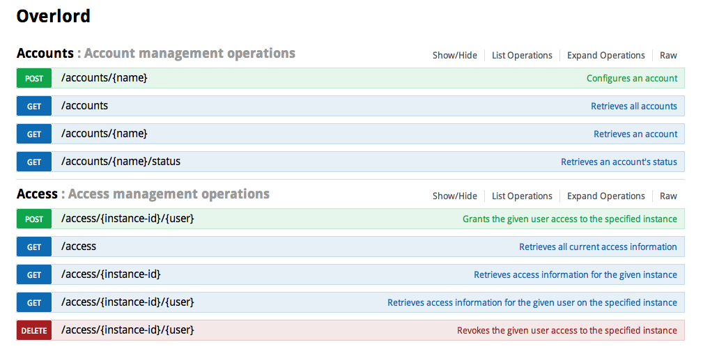

# Overlord

Overlord is an AWS account management tool. It supports one-time configuration, auditing and serves as a security gateway.

Accounting configuration is done in two phases:

### Manual Phase

- sign up for a new Amazon account
- set up consolidated billing
- remove billing information, e.g. credit card

### Automatic Phase

Any given VPC is split up into three sections: *public* for internet-level load balancers,
*shared* for company-internal load balancers and *private* for team-internal instances.

Based on the bits of the VPC CIDR block:

- two bits are reserved for public, shared and private
    - 1/4 public subnets
    - 1/4 shared subnets
    - 2/4 private subnets
- three bits are reserved for a maximum of 8 availability zones
- only public and shared subnets of the same team are allowed to access private subnets
- only private subnets of the same team and the internet are allowed to access the public subnet
- TODO how can we restrict the communication between public and shared across the company?

#### Tasks

- [CreateKeyPair](http://docs.aws.amazon.com/AWSEC2/latest/APIReference/ApiReference-query-CreateKeyPair.html)
- [CreateSAMLProvider](http://docs.aws.amazon.com/IAM/latest/APIReference/API_CreateSAMLProvider.html)
- [CreateRole](http://docs.aws.amazon.com/IAM/latest/APIReference/API_CreateRole.html) (SAML)
- set up AWS::Route53::HostedZone (team.aws.example.com)
- update internal name servers (TODO find out how)
- generate wildcard certificate \*.team.aws.example.com
- [UploadServerCertificate](http://docs.aws.amazon.com/IAM/latest/APIReference/API_UploadServerCertificate.html)
- per region (AWS::Region)
    - set up AWS::CloudTrail::Trail "CloudTrail"
    - set up AWS::EC2::VPC "Vpc"
    - per other team accounts
        - [CreateVpcPeeringConnection](http://docs.aws.amazon.com/AWSEC2/latest/APIReference/ApiReference-query-CreateVpcPeeringConnection.html)
        - in the other team's account: [AcceptVpcPeeringConnection](http://docs.aws.amazon.com/AWSEC2/latest/APIReference/ApiReference-query-AcceptVpcPeeringConnection.html)
    - set up AWS::EC2::InternetGateway "InternetGateway"
    - set up AWS::EC2::InternetGatewayAttachment "InternetGatewayAttachment" ("InternetGateway" → "Vpc")
    - set up AWS::EC2::RouteTable "InternetAccess"
    - set up AWS::EC2::Route "InternetGatewayRoute" (0.0.0.0/0 → "InternetGateway")
    - set up AWS::EC2::SecurityGroup "NatSecurityGroup" (→ "Vpc")
    - set up AWS::EC2::NetworkAcl "SharedNetworkAcl"
    - set up AWS::EC2::NetworkAclEntry "AllowSharedNetworkAclEntry" (allow Vpc CIDR → "SharedNetworkAcl")
    - set up AWS::EC2::NetworkAclEntry "DenyPublicToSharedNetworkAclEntry" (deny public CIDR → "SharedNetworkAcl")
    - set up AWS::EC2::NetworkAcl "PrivateNetworkAcl"
    - set up AWS::EC2::NetworkAclEntry "DenyPrivateNetworkAclEntry" (deny 0.0.0.0/0 → "PrivateNetworkAcl")
    - set up AWS::EC2::NetworkAclEntry "AllowPublicToPrivateNetworkAclEntry" (allow public CIDR → "PrivateNetworkAcl")
    - set up AWS::EC2::NetworkAclEntry "AllowSharedToPrivateNetworkAclEntry" (allow shared CIDR → "PrivateNetworkAcl")
    - per [availability zone](http://docs.aws.amazon.com/AWSEC2/latest/APIReference/ApiReference-query-DescribeAvailabilityZones.html)
        - set up AWS::EC2::Subnet "PublicSubnetAzX"
        - set up AWS::EC2::SubnetRouteTableAssociation "SubnetRouteAzX" ("PublicSubnetAzX" → "InternetAccess")
        - set up AWS::EC2::Instance "NatAzX" (using `amzn-ami-vpc-nat-pv` AMI)
        - TODO [high availbilty setup](https://aws.amazon.com/articles/2781451301784570) for NAT
        - set up AWS::EC2::EIP "NatEipAzX" (→ "NatAzx")
        - set up AWS::EC2::RouteTable "NatRouteTableAzX"
        - set up AWS::EC2::Route "NatDefaultRouteAzX" ("NatRouteTableAzX", 0.0.0.0/0 → "NatAzX")
        - set up AWS::EC2::Subnet "SharedSubnetAzX"
        - set up AWS::EC2::SubnetNetworkAclAssociation "SharedSubnetNetworkAclAssociationAzX" ("SharedSubnetAzX" → "SharedNetworkAcl")
        - set up AWS::EC2::Subnet "PrivateSubnetAzX"
        - set up AWS::EC2::SubnetRouteTableAssociation "PrivateNatRouteTableAssociationAzX" ("PrivateSubnetAzx" → "NatRouteTableAzX")
        - set up AWS::EC2::SubnetNetworkAclAssociation "PrivateSubnetNetworkAclAssociationAzX" ("PrivateSubnetAzX" → "PrivateNetworkAcl")

## API

## Data

### Account

- team name
- account id
- key id
- access key
- key pair (generated)
- server certificate (generated)
- networks
    - region
    - cidr block
    - subnets (generated)
        - availability zone
        - cidr block
        - type (shared, private, public)

### Access

- user name (LDAP)
- instance-id
- timestamp?!
- comment? (Ticket ID)

## Development

Use [Leinignen](http://leiningen.org/):

    $ lein run

or run the test suite

    $ lein test

or with a REPL:

    $ lein repl
    > (require '[com.stuartsierra.component :as component])
    > (def system (component/start (new-system (new-config nil))))
