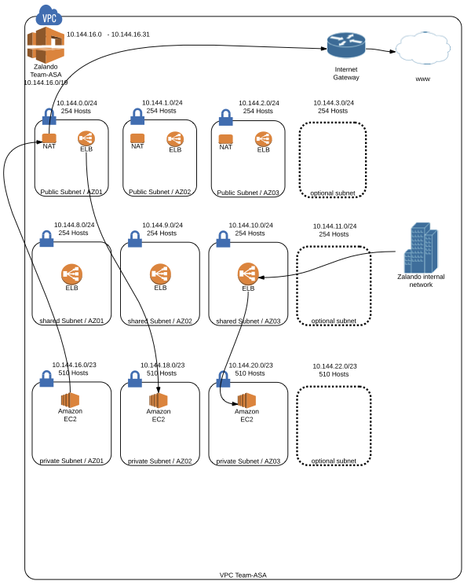

# Overlord

Overlord is an AWS account management tool. It supports one-time configuration, auditing and serves as a security gateway.

Accounting configuration is done in two phases:

## Manual Phase

- sign up for a new Amazon account
- set up consolidated billing
- remove billing information
- add root MFA
- set up overlord IAM user
- set up key-id and access-key (non root)

## Automatic Phase

Any given VPC is split up into three sections:

- 1/4 *public* for internet-level load balancers,
- 1/4 *shared* for company-internal load balancers and
- 1/2 *private* for team-internal instances.

Each section is partitioned into eight blocks, one for each availability zone.

Given the following information:

- Key ID
- Access key
- per region
    - CIDR block
    - VPN Gateway IP
    - VPN Routes
    - Name servers

Overlord will create the following setup:

## Development

Use [Leinignen](http://leiningen.org/):

    $ lein with-profile log run

or run the test suite

    $ lein db
    $ lein test

or with a REPL:

    $ lein repl
    > (require '[com.stuartsierra.component :as component])
    > (def system (component/start (new-system (new-config nil))))

or build a jar and run it

    $ lein uberjar
    $ java -jar target/aws-overlord.jar
