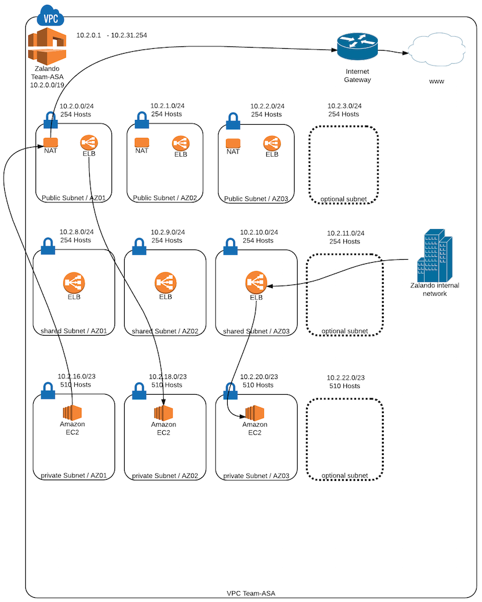

=============
Network Setup
=============

AWS Overlord creates the following network setup:

The setup includes:

VPC
===

A VPC will be created in the specified ``region`` using the given ``cidr-block``. DHCP options on the VPC will delegate
DNS requests to the name servers, specified using the ``name-servers`` key.

A VPC Peering Connection will be established across the new VPC and **all** existing VPCs.

.. note::

    Your AWS account is limited to 50 active VPC Peering Connections by default and can be increased to 125. Keep that
    limit in mind when designing your network topology.

The VPC's network will be split into three different types:

    - 25% Public
    - 25% Shared
    - 50% Private

The resulting networks are split into concrete subnets across all availability zones of the specified region. The
following tables shows the process for the VPC 10.2.0.0/19 on eu-west-1:

+---------------------------+------+----------------+
| Name                      | IPs  | CIDR block     |
+---------------------------+------+----------------+
| VPC                       | 8192 | 10.2.0.0/19    |
|                           |      |                |
| Private Subnets           | 2048 | 10.2.0.0/21    |
|                           |      |                |
| Shared Subnets            | 2048 | 10.2.8.0/21    |
|                           |      |                |
| Shared Subnets            | 4096 | 10.2.16.0/20   |
|                           |      |                |
| Public Subnet eu-west-1a  | 256  | 10.2.0.0/24    |
|                           |      |                |
| Public Subnet eu-west-1b  | 256  | 10.2.1.0/24    |
|                           |      |                |
| Public Subnet eu-west-1c  | 256  | 10.2.2.0/24    |
|                           |      |                |
| Shared Subnet eu-west-1a  | 256  | 10.2.8.0/24    |
|                           |      |                |
| Shared Subnet eu-west-1b  | 256  | 10.2.9.0/24    |
|                           |      |                |
| Shared Subnet eu-west-1c  | 256  | 10.2.10.0/24   |
|                           |      |                |
| Private Subnet eu-west-1a | 512  | 10.2.16.0/23   |
|                           |      |                |
| Private Subnet eu-west-1b | 512  | 10.2.18.0/23   |
|                           |      |                |
| Private Subnet eu-west-1c | 512  | 10.2.20.0/23   |
+---------------------------+------+----------------+

..
    generated with http://ascii.gallery/table

    Name,IPs,CIDR Block
    VPC,8192,10.2.0.0/19
    Private Subnets,2048,10.2.0.0/21
    Shared Subnets,2048,10.2.8.0/21
    Shared Subnets,4096,10.2.16.0/20
    Public Subnet eu-west-1a,256,10.2.0.0/24
    Public Subnet eu-west-1b,256,10.2.1.0/24
    Public Subnet eu-west-1c,256,10.2.2.0/24
    Shared Subnet eu-west-1a,256,10.2.8.0/24
    Shared Subnet eu-west-1b,256,10.2.9.0/24
    Shared Subnet eu-west-1c,256,10.2.10.0/24
    Private Subnet eu-west-1a,512,10.2.16.0/23
    Private Subnet eu-west-1b,512,10.2.18.0/23
    Private Subnet eu-west-1c,512,10.2.20.0/23

Public Subnets
--------------

Public subnets are reserved for internet-facing instances like public ELBs and NAT instances. All public subnets share
a single route table.

Shared Subnets
--------------

Shared subnets are reserved for company-wide ELBs and are accessible from their own as well as all peered VPCs. Each
shared subnet has its own route table as well as a route to their respective NAT instance in their availability zone.

Private Subnets
---------------

Private subnets are reserved for team-wide EC2 instances and/or private ELBs and are accessible from their own as well
as all peered VPCs by default. Each shared subnet has its own route table as well as a route to their respective NAT
instance in their availability zone.

.. danger::

    Private subnets, despite their name, are **not** secured by default. You need to use Security Groups on a
    case-by-case basis to limit access.

Internet Gateway and NAT
========================

The VPC will have an Internet Gateway attached to it. All Public Subnets route internet traffic through it. Shared and
Private Subnets will route their internet traffic through their respective NAT instance.

VPN
===

The network setup will include a VPN Connection between a VPN Gateway attached to the VPC and a Customer Gateway that
points the VPN endpoint in your DC, specified by the ``vpn-gateway-ip`` key. All Shared and Private Subnets will route
traffic through the VPN connection to all networks specified by the ``vpn-routes`` key.

.. warning::

    Each VPN gateway has to have a unique IP across **all** AWS accounts.